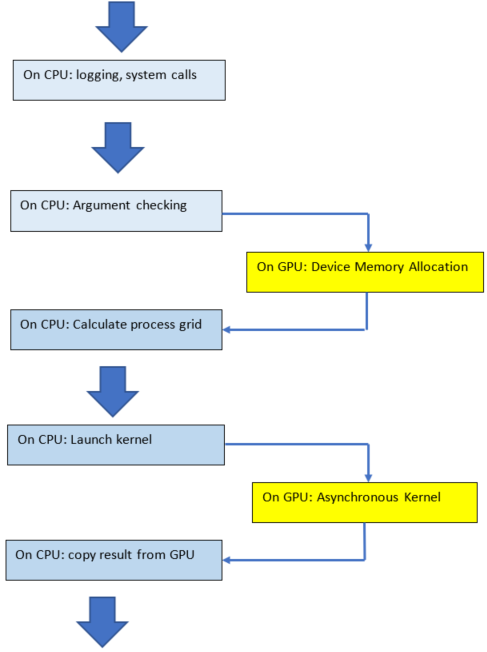

===================
API Reference Guide
===================

------------
Introduction
------------

rocBLAS is the AMD library for Basic Linear Algebra Subprograms (BLAS) on the `ROCm platform <https://docs.amd.com/>`__ . It is
implemented in the `HIP programming language <https://github.com/ROCm-Developer-Tools/HIP/>`__ and optimized for AMD GPUs.

The aim of rocBLAS is to provide:

- Functionality similar to Legacy BLAS, adapted to run on GPUs
- High-performance robust implementation

rocBLAS is written in C++17 and HIP. It uses the AMD ROCm runtime to run on GPU devices.

The rocBLAS API is a thin C99 API using the Hourglass Pattern. It contains:

- [Level1]_, [Level2]_, and [Level3]_ BLAS functions, with batched and strided_batched versions
- Extensions to Legacy BLAS, including functions for mixed precision
- Auxiliary functions
- Device Memory functions

.. note::
  - The official rocBLAS API is the C99 API defined in rocblas.h. Therefore the use of any other public symbols is discouraged. All other C/C++ interfaces may not follow a deprecation model and so can change without warning from one release to the next.
  - rocBLAS array storage format is column major and one based. This is to maintain compatibility with the Legacy BLAS code, which is written in Fortran.
  - rocBLAS calls the AMD library `Tensile <https://github.com/ROCmSoftwarePlatform/Tensile>`_ for Level 3 BLAS matrix multiplication.

-------------------------------------
rocBLAS API and Legacy BLAS Functions
-------------------------------------

rocBLAS is initialized by calling rocblas_create_handle, and it is terminated by calling rocblas_destroy_handle. The rocblas_handle is persistent, and it contains:

- HIP stream
- Temporary device work space
- Mode for enabling or disabling logging (default is logging disabled)

rocBLAS functions run on the host, and they call HIP to launch rocBLAS kernels that run on the device in a HIP stream. The kernels are asynchronous unless:

- The function returns a scalar result from device to host
- Temporary device memory is allocated

In both cases above, the launch can be made asynchronous by:

- Use rocblas_pointer_mode_device to keep the scalar result on the device. Note that it is only the following Level1 BLAS functions that return a scalar result: Xdot, Xdotu, Xnrm2, Xasum, iXamax, iXamin.

- Use the provided device memory functions to allocate device memory that persists in the handle. Note that most rocBLAS functions do not allocate temporary device memory.

Before calling a rocBLAS function, arrays must be copied to the device. Integer scalars like m, n, k are stored on the host. Floating point scalars like alpha and beta can be on host or device.

Error handling is by returning a rocblas_status. Functions conform to the Legacy BLAS argument checking.

Rules for Obtaining rocBLAS API from Legacy BLAS
^^^^^^^^^^^^^^^^^^^^^^^^^^^^^^^^^^^^^^^^^^^^^^^^

1. The Legacy BLAS routine name is changed to lowercase and prefixed
   by rocblas\_. For example: Legacy BLAS routine SSCAL, scales a vector by a constant, is converted to rocblas_sscal.

2. A first argument rocblas_handle handle is added to all rocBLAS
   functions.

3. Input arguments are declared with the const modifier.

4. Character arguments are replaced with enumerated types defined in
   rocblas_types.h. They are passed by value on the host.

5. Array arguments are passed by reference on the device.

6. Scalar arguments are passed by value on the host with the following
   exceptions. See the section Pointer Mode for more information on
   these exceptions:

-  Scalar values alpha and beta are passed by reference on either the
   host or the device.

-  Where Legacy BLAS functions have return values, the return value is
   instead added as the last function argument. It is returned by
   reference on either the host or the device. This applies to the
   following functions: xDOT, xDOTU, xNRM2, xASUM, IxAMAX, IxAMIN.

7. The return value of all functions is rocblas_status, defined in
   rocblas_types.h. It is used to check for errors.

Example Code
^^^^^^^^^^^^

Below is a simple example code for calling function rocblas_sscal:

.. code-block:: c++

   #include <iostream>
   #include <vector>
   #include "hip/hip_runtime_api.h"
   #include "rocblas.h"

   using namespace std;

   int main()
   {
       rocblas_int n = 10240;
       float alpha = 10.0;

       vector<float> hx(n);
       vector<float> hz(n);
       float* dx;

       rocblas_handle handle;
       rocblas_create_handle(&handle);

       // allocate memory on device
       hipMalloc(&dx, n * sizeof(float));

       // Initial Data on CPU,
       srand(1);
       for( int i = 0; i < n; ++i )
       {
           hx[i] = rand() % 10 + 1;  //generate a integer number between [1, 10]
       }

       // copy array from host memory to device memory
       hipMemcpy(dx, hx.data(), sizeof(float) * n, hipMemcpyHostToDevice);

       // call rocBLAS function
       rocblas_status status = rocblas_sscal(handle, n, &alpha, dx, 1);

       // check status for errors
       if(status == rocblas_status_success)
       {
           cout << "status == rocblas_status_success" << endl;
       }
       else
       {
           cout << "rocblas failure: status = " << status << endl;
       }

       // copy output from device memory to host memory
       hipMemcpy(hx.data(), dx, sizeof(float) * n, hipMemcpyDeviceToHost);

       hipFree(dx);
       rocblas_destroy_handle(handle);
       return 0;
   }

LP64 Interface
^^^^^^^^^^^^^^

The rocBLAS library default implementations are LP64, so rocblas_int arguments are 32 bit and
rocblas_stride arguments are 64 bit.

.. _ILP64 API:

ILP64 Interface
^^^^^^^^^^^^^^^

The rocBLAS library Level-1 functions are also provided with ILP64 interfaces. With these interfaces all rocblas_int arguments are replaced by the typename
int64_t.  These ILP64 function names all end with a suffix ``_64``.   The only output arguments that change are for the
xMAX and xMIN for which the index is now int64_t.  Performance should match the LP64 API when problem sizes don't require the additional
precision.  Function level documentation is not repeated for these API as they are identical in behavior to the LP64 versions,
however functions which support this alternate API include the line:
``This function supports the 64-bit integer interface (ILP64)``.

Column-major Storage and 1 Based Indexing
^^^^^^^^^^^^^^^^^^^^^^^^^^^^^^^^^^^^^^^^^

rocBLAS uses column-major storage for 2D arrays, and 1-based indexing
for the functions xMAX and xMIN. This is the same as Legacy BLAS and
cuBLAS.

If you need row-major and 0-based indexing (used in C language arrays), download the file cblas.tgz from the Netlib Repository.
Look at the CBLAS functions that provide a thin interface to Legacy BLAS. They convert from row-major, 0 based, to column-major, 1
based. This is done by swapping the order of function arguments. It is not necessary to transpose matrices.

Pointer Mode
^^^^^^^^^^^^

The auxiliary functions rocblas_set_pointer and rocblas_get_pointer are
used to set and get the value of the state variable
rocblas_pointer_mode. This variable is stored in rocblas_handle. If rocblas_pointer_mode ==
rocblas_pointer_mode_host, then scalar parameters must be allocated on
the host. If rocblas_pointer_mode == rocblas_pointer_mode_device, then
scalar parameters must be allocated on the device.

There are two types of scalar parameter:

* Scaling parameters like alpha and beta used in functions like axpy, gemv, gemm 2

* Scalar results from functions amax, amin, asum, dot, nrm2

For scalar parameters like alpha and beta when rocblas_pointer_mode ==
rocblas_pointer_mode_host, they can be allocated on the host heap or
stack. The kernel launch is asynchronous, and if they are on the heap,
they can be freed after the return from the kernel launch. When
rocblas_pointer_mode == rocblas_pointer_mode_device they must not be
changed till the kernel completes.

For scalar results, when rocblas_pointer_mode ==
rocblas_pointer_mode_host, then the function blocks the CPU till the GPU
has copied the result back to the host. When rocblas_pointer_mode ==
rocblas_pointer_mode_device the function will return after the
asynchronous launch. Similarly to vector and matrix results, the scalar
result is only available when the kernel has completed execution.

Asynchronous API
^^^^^^^^^^^^^^^^

rocBLAS functions will be asynchronous unless:

* The function needs to allocate device memory

* The function returns a scalar result from GPU to CPU

The order of operations in the asynchronous functions is as in the figure
below. The argument checking, calculation of process grid, and kernel
launch take very little time. The asynchronous kernel running on the GPU
does not block the CPU. After the kernel launch, the CPU keeps processing
the next instructions.

.. asynch_blocks
.. figure:: ./data/asynch_function.PNG
   :alt: code blocks in asynch function call
   :align: center

   Order of operations in asynchronous functions

The above order of operations will change if there is logging or the
function is synchronous. Logging requires system calls, and the program
must wait for them to complete before executing the next instruction.
See the Logging section for more information.

.. note:: The default is no logging.

If the cpu needs to allocate device memory, it must wait till this is complete before
executing the next instruction. See the Device Memory Allocation section for more information.

.. note:: Memory can be preallocated. This will make the function asynchronous, as it removes the need for the function to allocate memory.

The following functions copy a scalar result from GPU to CPU if
rocblas_pointer_mode == rocblas_pointer_mode_host: asum, dot, max, min, nrm2.

This makes the function synchronous, as the program must wait
for the copy before executing the next instruction. See the section on
Pointer Mode for more information.

.. note:: Set rocblas_pointer_mode to rocblas_pointer_mode_device makes the function asynchronous by keeping the result on the GPU.

The order of operations with logging, device memory allocation, and return of a scalar
result is as in the figure below:

.. asynch_blocks

   Code blocks in synchronous function call

Kernel launch status error checking
^^^^^^^^^^^^^^^^^^^^^^^^^^^^^^^^^^^
The function ``hipPeekAtLastError()`` is called before and after rocblas kernel launches. This will detect if launch parameters are incorrect, for example
invalid work-group or thread block sizes. It will also detect if the kernel code can not run on the current GPU device (returns ``rocblas_status_arch_mismatch``).
Note that ``hipPeekAtLastError()`` does not flush the last error. Reporting only a change in ``hipPeekAtLastError()`` as a detection system has the disadvantage
that if the previous last error from another kernel launch or hip call is the same as the error from the current kernel, then no error is reported.
Only the first error would be reported in this case.  You can avoid this behaviour by flushing any previous hip error before calling a rocBLAS function
by calling ``hipGetLastError()``. Note that both ``hipPeekAtLastError()`` and ``hipGetLastError()`` run synchronously on the CPU and they only check the kernel
launch, not the asynchronous work done by the kernel.  We do not clear the last error in case the caller was relying on it for detecting errors in
a batch of hip and rocBLAS function calls.

Complex Number Data Types
^^^^^^^^^^^^^^^^^^^^^^^^^

Data types for rocBLAS complex numbers in the API are a special case.  For C compiler users, gcc, and other non-hipcc compiler users, these types
are exposed as a struct with x and y components and identical memory layout to std::complex for float and double precision.   Internally a templated
C++ class is defined, but it should be considered deprecated for external use.   For simplified usage with Hipified code there is an option
to interpret the API as using hipFloatComplex and hipDoubleComplex types (i.e. typedef hipFloatComplex rocblas_float_complex).  This is provided
for users to avoid casting when using the hip complex types in their code.  As the memory layout is consistent across all three types,
it is safe to cast arguments to API calls between the 3 types: hipFloatComplex, std::complex<float>, and rocblas_float_complex, as well as for
the double precision variants. To expose the API as using the hip defined complex types, user can use either a compiler define or inlined
#define ROCM_MATHLIBS_API_USE_HIP_COMPLEX before including the header file <rocblas.h>.  Thus the API is compatible with both forms, but
recompilation is required to avoid casting if switching to pass in the hip complex types.  Most device memory pointers are passed with void*
types to hip utility functions (e.g. hipMemcpy), so uploading memory from std::complex arrays or hipFloatComplex arrays requires no changes
regardless of complex data type API choice.

.. _Atomic Operations:

Atomic Operations
^^^^^^^^^^^^^^^^^

Some functions within the rocBLAS library such as gemv, symv, trsv, trsm, and gemm may use atomic operations to increase performance.
By using atomics, functions may not give bit-wise reproducible results. Differences between multiple runs should not be significant and will
remain accurate, but if users require identical results across multiple runs, atomics should be turned off. See :any:`rocblas_atomics_mode`,
:any:`rocblas_set_atomics_mode`, and :any:`rocblas_get_atomics_mode`.

MI100 (gfx908) Considerations
^^^^^^^^^^^^^^^^^^^^^^^^^^^^^

On nodes with the MI100 (gfx908), MFMA (Matrix-Fused-Multiply-Add)
instructions are available to substantially speed up matrix operations.
This hardware feature is used in all gemm and gemm-based functions in
rocBLAS with 32-bit or shorter base datatypes with an associated 32-bit
compute_type (f32_r, i32_r, or f32_c as appropriate).

Specifically, rocBLAS takes advantage of MI100's MFMA instructions for
three real base types f16_r, bf16_r, and f32_r with compute_type f32_r,
one integral base type i8_r with compute_type i32_r, and one complex
base type f32_c with compute_type f32_c.  In summary, all GEMM APIs and
APIs for GEMM-based functions using these five base types and their
associated compute_type (explicit or implicit) take advantage of MI100's
MFMA instructions.

.. note::

   The use of MI100's MFMA instructions is automatic.  There is no user control for on/off.

   Not all problem sizes may select MFMA-based kernels; additional tuning may be needed to get good performance.

MI200 (gfx90a) Considerations
^^^^^^^^^^^^^^^^^^^^^^^^^^^^^

On nodes with the MI200 (gfx90a), MFMA_F64 instructions are available to
substantially speed up double precision matrix operations.  This
hardware feature is used in all GEMM and GEMM-based functions in
rocBLAS with 64-bit floating-point datatype, namely DGEMM, ZGEMM,
DTRSM, ZTRSM, DTRMM, ZTRMM, DSYRKX, and ZSYRKX.

The MI200 MFMA_F16, MFMA_BF16 and MFMA_BF16_1K instructions
flush subnormal input/output data ("denorms") to zero. It is observed that
certain use cases utilizing the HPA (High Precision Accumulate) HGEMM
kernels where a_type=b_type=c_type=d_type=f16_r and compute_type=f32_r
do not tolerate the MI200's flush-denorms-to-zero behavior well
due to F16's limited exponent range. An alternate implementation of the
HPA HGEMM kernel utilizing the MFMA_BF16_1K instruction is provided which,
takes advantage of BF16's much larger exponent range, albeit with reduced
accuracy.  To select the alternate implementation of HPA HGEMM with the
gemm_ex/gemm_strided_batched_ex functions, for the flags argument, use
the enum value of rocblas_gemm_flags_fp16_alt_impl.

.. note::

   The use of MI200's MFMA instructions (including MFMA_F64) is automatic.  There is no user control for on/off.

   Not all problem sizes may select MFMA-based kernels; additional tuning may be needed to get good performance.

-----------------------
Deprecations by version
-----------------------

Announced in rocBLAS 2.45
^^^^^^^^^^^^^^^^^^^^^^^^^

Replace is_complex by rocblas_is_complex
''''''''''''''''''''''''''''''''''''''''

From rocBLAS 3.0 the trait is_complex for rocblas complex types has been removed. Replace with rocblas_is_complex

Replace truncate with rocblas_truncate
''''''''''''''''''''''''''''''''''''''

From rocBLAS 3.0 enum truncate_t and the value truncate has been removed and replaced by rocblas_truncate_t
and rocblas_truncate, respectively.

Announced in rocBLAS 2.46
^^^^^^^^^^^^^^^^^^^^^^^^^

Remove ability for hipBLAS to set rocblas_int8_type_for_hipblas
'''''''''''''''''''''''''''''''''''''''''''''''''''''''''''''''

From rocBLAS 3.0 remove enum rocblas_int8_type_for_hipblas and the functions rocblas_get_int8_type_for_hipblas and
rocblas_set_int8_type_for_hipblas. These are used by hipBLAS to select either int8_t or packed_int8x4 datatype.
In hipBLAS the option to use packed_int8x4 will be removed, only int8_t will be available.

Announced in rocBLAS 3.0
^^^^^^^^^^^^^^^^^^^^^^^^

Replace Legacy BLAS in-place trmm functions with trmm functions that support both in-place and out-of-place functionality
'''''''''''''''''''''''''''''''''''''''''''''''''''''''''''''''''''''''''''''''''''''''''''''''''''''''''''''''''''''''''
Use of the deprecated Legacy BLAS in-place trmm functions will give deprecation warnings telling
you to compile with -DROCBLAS_V3 and use the new in-place and out-of-place trmm functions.

Note that there are no deprecation warnings for the rocBLAS Fortran API.

The Legacy BLAS in-place trmm calculates B <- alpha * op(A) * B. Matrix B is replaced in-place by
triangular matrix A multiplied by matrix B. The prototype in the include file rocblas-functions.h is:

::

    rocblas_status rocblas_strmm(rocblas_handle    handle,
                                 rocblas_side      side,
                                 rocblas_fill      uplo,
                                 rocblas_operation transA,
                                 rocblas_diagonal  diag,
                                 rocblas_int       m,
                                 rocblas_int       n,
                                 const float*      alpha,
                                 const float*      A,
                                 rocblas_int       lda,
                                 float*            B,
                                 rocblas_int       ldb);

rocBLAS 3.0 deprecates the legacy BLAS trmm functionality and replaces it with C <- alpha * op(A) * B. The prototype is:

::

    rocblas_status rocblas_strmm(rocblas_handle    handle,
                                 rocblas_side      side,
                                 rocblas_fill      uplo,
                                 rocblas_operation transA,
                                 rocblas_diagonal  diag,
                                 rocblas_int       m,
                                 rocblas_int       n,
                                 const float*      alpha,
                                 const float*      A,
                                 rocblas_int       lda,
                                 const float*      B,
                                 rocblas_int       ldb,
                                 float*            C,
                                 rocblas_int       ldc);

The new API provides the legacy BLAS in-place functionality if you set pointer C equal to pointer B and
ldc equal to ldb.

There are similar deprecations for the _batched and _strided_batched versions of trmm.

Remove rocblas_gemm_ext2
''''''''''''''''''''''''
rocblas_gemm_ext2 is deprecated and it will be removed in the next major release of rocBLAS.

Removal of rocblas_query_int8_layout_flag
'''''''''''''''''''''''''''''''''''''''''
rocblas_query_int8_layout_flag will be removed and support will end for the rocblas_gemm_flags_pack_int8x4 enum in rocblas_gemm_flags
in a future release. rocblas_int8_type_for_hipblas will remain until rocblas_query_int8_layout_flag is removed.

Remove user_managed mode from rocblas_handle
''''''''''''''''''''''''''''''''''''''''''''

From rocBLAS 4.0, the schemes for allocating temporary device memory would be reduced to two from four.

Existing four schemes are:

* rocblas_managed
* user_managed, preallocate
* user_managed, manual
* user_owned

From rocBLAS 4.0, the two schemes would be rocblas_managed and user_owned.
The functionality of user_managed ( both preallocate and manual) would be combined into rocblas_managed scheme.

Due to this the following APIs would be affected:

* `rocblas_is_user_managing_device_memory()` will be removed.
* `rocblas_set_device_memory_size()` will be replaced by a future function `rocblas_increase_device_memory_size()`, this new API would allow users to increase the device memory pool size at runtime.

Announced in rocBLAS 3.1
^^^^^^^^^^^^^^^^^^^^^^^^

Removal of __STDC_WANT_IEC_60559_TYPES_EXT__ define
'''''''''''''''''''''''''''''''''''''''''''''''''''

Prior to rocBLAS 4.0, __STDC_WANT_IEC_60559_TYPES_EXT__ was defined in rocblas.h, or more specifically rocblas-types.h, before including float.h. From rocBLAS 4.0, this
define will be removed. Users who want ISO/IEC TS 18661-3:2015 functionality must define __STDC_WANT_IEC_60559_TYPES_EXT__ before including float.h and rocblas.h.

Announced in rocBLAS 4.0
^^^^^^^^^^^^^^^^^^^^^^^^

Atomic operations will be disabled by default
'''''''''''''''''''''''''''''''''''''''''''''

The default :any:`rocblas_atomics_mode` in :any:`rocblas_handle` will change in the future to :any:`rocblas_atomics_not_allowed` from the current :any:`rocblas_atomics_allowed`.
Thus the default will allow for improved determinism over performance.
Users can add explicit control and not be affected by this change by calling the function :any:`rocblas_set_atomics_mode`.

Removed in rocBLAS 4.0
^^^^^^^^^^^^^^^^^^^^^^

rocblas_gemm_ext2 removed
'''''''''''''''''''''''''

rocblas_gemm_ext2 API function was removed in 4.0.

rocblas_gemm_flags_pack_int8x4 gemm support removed
'''''''''''''''''''''''''''''''''''''''''''''''''''

Packed int8x4 support was removed as support for arbitrary dimensioned int8_t data is a superset of this functionality:

* rocblas_gemm_flags_pack_int8x4 enum value in rocblas_gemm_flags was removed
* struct rocblas_int8x4 was removed
* function rocblas_query_int8_layout_flag was removed
* enum rocblas_int8_type_for_hipblas type was removed

Legacy BLAS in-place trmm API removed
'''''''''''''''''''''''''''''''''''''
The Legacy BLAS in-place trmm API is removed. It is replaced by an API that supports both in-place and out-of-place trmm.
The Legacy BLAS in-place trmm calculated

::

   B <- alpha * op(A) * B

The in-place and out-of-place trmm API calculates

::

   C <- alpha * op(A) * B

The in-place functionality is available by setting C the same as B and ldb = ldc. For out-of-place functionality C and B are different.

Removal of __STDC_WANT_IEC_60559_TYPES_EXT__ define
'''''''''''''''''''''''''''''''''''''''''''''''''''
The #define __STDC_WANT_IEC_60559_TYPES_EXT__ has been removed from rocblas-types.h. Users who want ISO/IEC TS 18661-3:2015 functionality
must define __STDC_WANT_IEC_60559_TYPES_EXT__ before including float.h, math.h, and rocblas.h.

=================
Using rocBLAS API
=================

This section describes how to use the rocBLAS library API.

-----------------
rocBLAS Datatypes
-----------------

rocblas_handle
^^^^^^^^^^^^^^^

.. doxygentypedef:: rocblas_handle

rocblas_int
^^^^^^^^^^^

.. doxygentypedef:: rocblas_int

rocblas_stride
^^^^^^^^^^^^^^

.. doxygentypedef:: rocblas_stride

rocblas_half
^^^^^^^^^^^^

.. doxygenstruct:: rocblas_half

rocblas_bfloat16
^^^^^^^^^^^^^^^^

.. doxygenstruct:: rocblas_bfloat16

rocblas_float_complex
^^^^^^^^^^^^^^^^^^^^^

.. doxygenstruct:: rocblas_float_complex

rocblas_double_complex
^^^^^^^^^^^^^^^^^^^^^^

.. doxygenstruct:: rocblas_double_complex

-------------------
rocBLAS Enumeration
-------------------

   Enumeration constants have numbering that is consistent with CBLAS, ACML, most standard C BLAS libraries

rocblas_operation
^^^^^^^^^^^^^^^^^

.. doxygenenum:: rocblas_operation

rocblas_fill
^^^^^^^^^^^^

.. doxygenenum:: rocblas_fill

rocblas_diagonal
^^^^^^^^^^^^^^^^

.. doxygenenum:: rocblas_diagonal

rocblas_side
^^^^^^^^^^^^

.. doxygenenum:: rocblas_side

rocblas_status
^^^^^^^^^^^^^^

.. doxygenenum:: rocblas_status

rocblas_datatype
^^^^^^^^^^^^^^^^

.. doxygenenum:: rocblas_datatype

rocblas_pointer_mode
^^^^^^^^^^^^^^^^^^^^

.. doxygenenum:: rocblas_pointer_mode

rocblas_atomics_mode
^^^^^^^^^^^^^^^^^^^^

.. doxygenenum:: rocblas_atomics_mode

rocblas_layer_mode
^^^^^^^^^^^^^^^^^^

.. doxygenenum:: rocblas_layer_mode

rocblas_gemm_algo
^^^^^^^^^^^^^^^^^

.. doxygenenum:: rocblas_gemm_algo

rocblas_gemm_flags
^^^^^^^^^^^^^^^^^^

.. doxygenenum:: rocblas_gemm_flags

------------------------
rocBLAS Helper functions
------------------------

Auxiliary Functions
^^^^^^^^^^^^^^^^^^^

.. doxygenfunction:: rocblas_create_handle
.. doxygenfunction:: rocblas_destroy_handle
.. doxygenfunction:: rocblas_set_stream
.. doxygenfunction:: rocblas_get_stream
.. doxygenfunction:: rocblas_set_pointer_mode
.. doxygenfunction:: rocblas_get_pointer_mode
.. doxygenfunction:: rocblas_set_atomics_mode
.. doxygenfunction:: rocblas_get_atomics_mode
.. doxygenfunction:: rocblas_pointer_to_mode
.. doxygenfunction:: rocblas_set_vector
.. doxygenfunction:: rocblas_get_vector
.. doxygenfunction:: rocblas_set_matrix
.. doxygenfunction:: rocblas_get_matrix
.. doxygenfunction:: rocblas_set_vector_async
.. doxygenfunction:: rocblas_set_matrix_async
.. doxygenfunction:: rocblas_get_matrix_async
.. doxygenfunction:: rocblas_initialize
.. doxygenfunction:: rocblas_status_to_string

Device Memory Allocation Functions
^^^^^^^^^^^^^^^^^^^^^^^^^^^^^^^^^^

.. doxygenfunction:: rocblas_start_device_memory_size_query
.. doxygenfunction:: rocblas_stop_device_memory_size_query
.. doxygenfunction:: rocblas_get_device_memory_size
.. doxygenfunction:: rocblas_set_device_memory_size
.. doxygenfunction:: rocblas_set_workspace
.. doxygenfunction:: rocblas_is_managing_device_memory
.. doxygenfunction:: rocblas_is_user_managing_device_memory

For more detailed informationt, refer to sections :ref:`Device Memory Allocation Usage` and :ref:`Device Memory allocation in detail`.

Build Information Functions
^^^^^^^^^^^^^^^^^^^^^^^^^^^

.. doxygenfunction:: rocblas_get_version_string_size
.. doxygenfunction:: rocblas_get_version_string

-------------------------
rocBLAS Level-1 functions
-------------------------

Level-1 functions support the ILP64 API.  For more information on these `_64` functions, refer to section :ref:`ILP64 API`.

rocblas_iXamax + batched, strided_batched
^^^^^^^^^^^^^^^^^^^^^^^^^^^^^^^^^^^^^^^^^

.. doxygenfunction:: rocblas_isamax
   :outline:
.. doxygenfunction:: rocblas_idamax
   :outline:
.. doxygenfunction:: rocblas_icamax
   :outline:
.. doxygenfunction:: rocblas_izamax

The amax functions support the _64 interface.  Refer to section :ref:`ILP64 API`.

.. doxygenfunction:: rocblas_isamax_batched
   :outline:
.. doxygenfunction:: rocblas_idamax_batched
   :outline:
.. doxygenfunction:: rocblas_icamax_batched
   :outline:
.. doxygenfunction:: rocblas_izamax_batched

The amax_batched functions support the _64 interface.  Refer to section :ref:`ILP64 API`.

.. doxygenfunction:: rocblas_isamax_strided_batched
   :outline:
.. doxygenfunction:: rocblas_idamax_strided_batched
   :outline:
.. doxygenfunction:: rocblas_icamax_strided_batched
   :outline:
.. doxygenfunction:: rocblas_izamax_strided_batched

The amax_strided_batched functions support the _64 interface.  Refer to section :ref:`ILP64 API`.

rocblas_iXamin + batched, strided_batched
^^^^^^^^^^^^^^^^^^^^^^^^^^^^^^^^^^^^^^^^^

.. doxygenfunction:: rocblas_isamin
   :outline:
.. doxygenfunction:: rocblas_idamin
   :outline:
.. doxygenfunction:: rocblas_icamin
   :outline:
.. doxygenfunction:: rocblas_izamin

The amin functions support the _64 interface.  Refer to section :ref:`ILP64 API`.

.. doxygenfunction:: rocblas_isamin_batched
   :outline:
.. doxygenfunction:: rocblas_idamin_batched
   :outline:
.. doxygenfunction:: rocblas_icamin_batched
   :outline:
.. doxygenfunction:: rocblas_izamin_batched

The amin_batched functions support the _64 interface.  Refer to section :ref:`ILP64 API`.

.. doxygenfunction:: rocblas_isamin_strided_batched
   :outline:
.. doxygenfunction:: rocblas_idamin_strided_batched
   :outline:
.. doxygenfunction:: rocblas_icamin_strided_batched
   :outline:
.. doxygenfunction:: rocblas_izamin_strided_batched

The amin_strided_batched functions support the _64 interface.  Refer to section :ref:`ILP64 API`.

rocblas_Xasum + batched, strided_batched
^^^^^^^^^^^^^^^^^^^^^^^^^^^^^^^^^^^^^^^^

.. doxygenfunction:: rocblas_sasum
   :outline:
.. doxygenfunction:: rocblas_dasum
   :outline:
.. doxygenfunction:: rocblas_scasum
   :outline:
.. doxygenfunction:: rocblas_dzasum

The asum functions support the _64 interface.  Refer to section :ref:`ILP64 API`.

.. doxygenfunction:: rocblas_sasum_batched
   :outline:
.. doxygenfunction:: rocblas_dasum_batched
   :outline:
.. doxygenfunction:: rocblas_scasum_batched
   :outline:
.. doxygenfunction:: rocblas_dzasum_batched

The asum_batched functions support the _64 interface.  Refer to section :ref:`ILP64 API`.

.. doxygenfunction:: rocblas_sasum_strided_batched
   :outline:
.. doxygenfunction:: rocblas_dasum_strided_batched
   :outline:
.. doxygenfunction:: rocblas_scasum_strided_batched
   :outline:
.. doxygenfunction:: rocblas_dzasum_strided_batched

The asum_strided_batched functions support the _64 interface.  Refer to section :ref:`ILP64 API`.

rocblas_Xaxpy + batched, strided_batched
^^^^^^^^^^^^^^^^^^^^^^^^^^^^^^^^^^^^^^^^^

.. doxygenfunction:: rocblas_saxpy
   :outline:
.. doxygenfunction:: rocblas_daxpy
   :outline:
.. doxygenfunction:: rocblas_haxpy
   :outline:
.. doxygenfunction:: rocblas_caxpy
   :outline:
.. doxygenfunction:: rocblas_zaxpy

The axpy functions support the _64 interface.  Refer to section :ref:`ILP64 API`.

.. doxygenfunction:: rocblas_saxpy_batched
   :outline:
.. doxygenfunction:: rocblas_daxpy_batched
   :outline:
.. doxygenfunction:: rocblas_haxpy_batched
   :outline:
.. doxygenfunction:: rocblas_caxpy_batched
   :outline:
.. doxygenfunction:: rocblas_zaxpy_batched

The axpy_batched functions support the _64 interface.  Refer to section :ref:`ILP64 API`.

.. doxygenfunction:: rocblas_saxpy_strided_batched
   :outline:
.. doxygenfunction:: rocblas_daxpy_strided_batched
   :outline:
.. doxygenfunction:: rocblas_haxpy_strided_batched
   :outline:
.. doxygenfunction:: rocblas_caxpy_strided_batched
   :outline:
.. doxygenfunction:: rocblas_zaxpy_strided_batched

The axpy_strided_batched functions support the _64 interface.  Refer to section :ref:`ILP64 API`.

rocblas_Xcopy + batched, strided_batched
^^^^^^^^^^^^^^^^^^^^^^^^^^^^^^^^^^^^^^^^^

.. doxygenfunction:: rocblas_scopy
   :outline:
.. doxygenfunction:: rocblas_dcopy
   :outline:
.. doxygenfunction:: rocblas_ccopy
   :outline:
.. doxygenfunction:: rocblas_zcopy

The copy functions support the _64 interface.  Refer to section :ref:`ILP64 API`.

.. doxygenfunction:: rocblas_scopy_batched
   :outline:
.. doxygenfunction:: rocblas_dcopy_batched
   :outline:
.. doxygenfunction:: rocblas_ccopy_batched
   :outline:
.. doxygenfunction:: rocblas_zcopy_batched

The copy_batched functions support the _64 interface.  Refer to section :ref:`ILP64 API`.

.. doxygenfunction:: rocblas_scopy_strided_batched
   :outline:
.. doxygenfunction:: rocblas_dcopy_strided_batched
   :outline:
.. doxygenfunction:: rocblas_ccopy_strided_batched
   :outline:
.. doxygenfunction:: rocblas_zcopy_strided_batched

The copy_strided_batched functions support the _64 interface.  Refer to section :ref:`ILP64 API`.

rocblas_Xdot + batched, strided_batched
^^^^^^^^^^^^^^^^^^^^^^^^^^^^^^^^^^^^^^^

.. doxygenfunction:: rocblas_sdot
   :outline:
.. doxygenfunction:: rocblas_ddot
   :outline:
.. doxygenfunction:: rocblas_hdot
   :outline:
.. doxygenfunction:: rocblas_bfdot
   :outline:
.. doxygenfunction:: rocblas_cdotu
   :outline:
.. doxygenfunction:: rocblas_cdotc
   :outline:
.. doxygenfunction:: rocblas_zdotu
   :outline:
.. doxygenfunction:: rocblas_zdotc

The dot/c/u functions support the _64 interface.  Refer to section :ref:`ILP64 API`.

.. doxygenfunction:: rocblas_sdot_batched
   :outline:
.. doxygenfunction:: rocblas_ddot_batched
   :outline:
.. doxygenfunction:: rocblas_hdot_batched
   :outline:
.. doxygenfunction:: rocblas_bfdot_batched
   :outline:
.. doxygenfunction:: rocblas_cdotu_batched
   :outline:
.. doxygenfunction:: rocblas_cdotc_batched
   :outline:
.. doxygenfunction:: rocblas_zdotu_batched
   :outline:
.. doxygenfunction:: rocblas_zdotc_batched

The dot/c/u_batched functions support the _64 interface.  Refer to section :ref:`ILP64 API`.

.. doxygenfunction:: rocblas_sdot_strided_batched
   :outline:
.. doxygenfunction:: rocblas_ddot_strided_batched
   :outline:
.. doxygenfunction:: rocblas_hdot_strided_batched
   :outline:
.. doxygenfunction:: rocblas_bfdot_strided_batched
   :outline:
.. doxygenfunction:: rocblas_cdotu_strided_batched
   :outline:
.. doxygenfunction:: rocblas_cdotc_strided_batched
   :outline:
.. doxygenfunction:: rocblas_zdotu_strided_batched
   :outline:
.. doxygenfunction:: rocblas_zdotc_strided_batched

The dot/c/u_strided_batched functions support the _64 interface.  Refer to section :ref:`ILP64 API`.

rocblas_Xnrm2 + batched, strided_batched
^^^^^^^^^^^^^^^^^^^^^^^^^^^^^^^^^^^^^^^^

.. doxygenfunction:: rocblas_snrm2
   :outline:
.. doxygenfunction:: rocblas_dnrm2
   :outline:
.. doxygenfunction:: rocblas_scnrm2
   :outline:
.. doxygenfunction:: rocblas_dznrm2

The nrm2 functions support the _64 interface.  Refer to section :ref:`ILP64 API`.

.. doxygenfunction:: rocblas_snrm2_batched
   :outline:
.. doxygenfunction:: rocblas_dnrm2_batched
   :outline:
.. doxygenfunction:: rocblas_scnrm2_batched
   :outline:
.. doxygenfunction:: rocblas_dznrm2_batched

The nrm2_batched functions support the _64 interface.  Refer to section :ref:`ILP64 API`.

.. doxygenfunction:: rocblas_snrm2_strided_batched
   :outline:
.. doxygenfunction:: rocblas_dnrm2_strided_batched
   :outline:
.. doxygenfunction:: rocblas_scnrm2_strided_batched
   :outline:
.. doxygenfunction:: rocblas_dznrm2_strided_batched

The nrm2_strided_batched functions support the _64 interface.  Refer to section :ref:`ILP64 API`.

rocblas_Xrot + batched, strided_batched
^^^^^^^^^^^^^^^^^^^^^^^^^^^^^^^^^^^^^^^

.. doxygenfunction:: rocblas_srot
   :outline:
.. doxygenfunction:: rocblas_drot
   :outline:
.. doxygenfunction:: rocblas_crot
   :outline:
.. doxygenfunction:: rocblas_csrot
   :outline:
.. doxygenfunction:: rocblas_zrot
   :outline:
.. doxygenfunction:: rocblas_zdrot

The rot functions support the _64 interface.  Refer to section :ref:`ILP64 API`.

.. doxygenfunction:: rocblas_srot_batched
   :outline:
.. doxygenfunction:: rocblas_drot_batched
   :outline:
.. doxygenfunction:: rocblas_crot_batched
   :outline:
.. doxygenfunction:: rocblas_csrot_batched
   :outline:
.. doxygenfunction:: rocblas_zrot_batched
   :outline:
.. doxygenfunction:: rocblas_zdrot_batched

The rot_batched functions support the _64 interface.  Refer to section :ref:`ILP64 API`.

.. doxygenfunction:: rocblas_srot_strided_batched
   :outline:
.. doxygenfunction:: rocblas_drot_strided_batched
   :outline:
.. doxygenfunction:: rocblas_crot_strided_batched
   :outline:
.. doxygenfunction:: rocblas_csrot_strided_batched
   :outline:
.. doxygenfunction:: rocblas_zrot_strided_batched
   :outline:
.. doxygenfunction:: rocblas_zdrot_strided_batched

The rot_strided_batched functions support the _64 interface.  Refer to section :ref:`ILP64 API`.

rocblas_Xrotg + batched, strided_batched
^^^^^^^^^^^^^^^^^^^^^^^^^^^^^^^^^^^^^^^^

.. doxygenfunction:: rocblas_srotg
   :outline:
.. doxygenfunction:: rocblas_drotg
   :outline:
.. doxygenfunction:: rocblas_crotg
   :outline:
.. doxygenfunction:: rocblas_zrotg

The rotg functions support the _64 interface.  Refer to section :ref:`ILP64 API`.

.. doxygenfunction:: rocblas_srotg_batched
   :outline:
.. doxygenfunction:: rocblas_drotg_batched
   :outline:
.. doxygenfunction:: rocblas_crotg_batched
   :outline:
.. doxygenfunction:: rocblas_zrotg_batched

The rotg_batched functions support the _64 interface.  Refer to section :ref:`ILP64 API`.

.. doxygenfunction:: rocblas_srotg_strided_batched
   :outline:
.. doxygenfunction:: rocblas_drotg_strided_batched
   :outline:
.. doxygenfunction:: rocblas_crotg_strided_batched
   :outline:
.. doxygenfunction:: rocblas_zrotg_strided_batched

The rotg_strided_batched functions support the _64 interface.  Refer to section :ref:`ILP64 API`.

rocblas_Xrotm + batched, strided_batched
^^^^^^^^^^^^^^^^^^^^^^^^^^^^^^^^^^^^^^^^^

.. doxygenfunction:: rocblas_srotm
   :outline:
.. doxygenfunction:: rocblas_drotm

The rotm functions support the _64 interface.  Refer to section :ref:`ILP64 API`.

.. doxygenfunction:: rocblas_srotm_batched
   :outline:
.. doxygenfunction:: rocblas_drotm_batched

The rotm_batched functions support the _64 interface.  Refer to section :ref:`ILP64 API`.

.. doxygenfunction:: rocblas_srotm_strided_batched
   :outline:
.. doxygenfunction:: rocblas_drotm_strided_batched

The rotm_strided_batched functions support the _64 interface.  Refer to section :ref:`ILP64 API`.

rocblas_Xrotmg + batched, strided_batched
^^^^^^^^^^^^^^^^^^^^^^^^^^^^^^^^^^^^^^^^^^

.. doxygenfunction:: rocblas_srotmg
   :outline:
.. doxygenfunction:: rocblas_drotmg

The rotmg functions support the _64 interface.  Refer to section :ref:`ILP64 API`.

.. doxygenfunction:: rocblas_srotmg_batched
   :outline:
.. doxygenfunction:: rocblas_drotmg_batched

The rotmg_batched functions support the _64 interface.  Refer to section :ref:`ILP64 API`.

.. doxygenfunction:: rocblas_srotmg_strided_batched
   :outline:
.. doxygenfunction:: rocblas_drotmg_strided_batched

The rotmg_strided_batched functions support the _64 interface.  Refer to section :ref:`ILP64 API`.

rocblas_Xscal + batched, strided_batched
^^^^^^^^^^^^^^^^^^^^^^^^^^^^^^^^^^^^^^^^^

.. doxygenfunction:: rocblas_sscal
   :outline:
.. doxygenfunction:: rocblas_dscal
   :outline:
.. doxygenfunction:: rocblas_cscal
   :outline:
.. doxygenfunction:: rocblas_zscal
   :outline:
.. doxygenfunction:: rocblas_csscal
   :outline:
.. doxygenfunction:: rocblas_zdscal

The scal functions support the _64 interface.  Refer to section :ref:`ILP64 API`.

.. doxygenfunction:: rocblas_sscal_batched
   :outline:
.. doxygenfunction:: rocblas_dscal_batched
   :outline:
.. doxygenfunction:: rocblas_cscal_batched
   :outline:
.. doxygenfunction:: rocblas_zscal_batched
   :outline:
.. doxygenfunction:: rocblas_csscal_batched
   :outline:
.. doxygenfunction:: rocblas_zdscal_batched

The scal_batched functions support the _64 interface.  Refer to section :ref:`ILP64 API`.

.. doxygenfunction:: rocblas_sscal_strided_batched
   :outline:
.. doxygenfunction:: rocblas_dscal_strided_batched
   :outline:
.. doxygenfunction:: rocblas_cscal_strided_batched
   :outline:
.. doxygenfunction:: rocblas_zscal_strided_batched
   :outline:
.. doxygenfunction:: rocblas_csscal_strided_batched
   :outline:
.. doxygenfunction:: rocblas_zdscal_strided_batched

The scal_strided_batched functions support the _64 interface.  Refer to section :ref:`ILP64 API`.

rocblas_Xswap + batched, strided_batched
^^^^^^^^^^^^^^^^^^^^^^^^^^^^^^^^^^^^^^^^^

.. doxygenfunction:: rocblas_sswap
   :outline:
.. doxygenfunction:: rocblas_dswap
   :outline:
.. doxygenfunction:: rocblas_cswap
   :outline:
.. doxygenfunction:: rocblas_zswap

The swap functions support the _64 interface.  Refer to section :ref:`ILP64 API`.

.. doxygenfunction:: rocblas_sswap_batched
   :outline:
.. doxygenfunction:: rocblas_dswap_batched
   :outline:
.. doxygenfunction:: rocblas_cswap_batched
   :outline:
.. doxygenfunction:: rocblas_zswap_batched

The swap_batched functions support the _64 interface.  Refer to section :ref:`ILP64 API`.

.. doxygenfunction:: rocblas_sswap_strided_batched
   :outline:
.. doxygenfunction:: rocblas_dswap_strided_batched
   :outline:
.. doxygenfunction:: rocblas_cswap_strided_batched
   :outline:
.. doxygenfunction:: rocblas_zswap_strided_batched

The swap_strided_batched functions support the _64 interface.  Refer to section :ref:`ILP64 API`.

-------------------------
rocBLAS Level-2 functions
-------------------------

rocblas_Xgbmv + batched, strided_batched
^^^^^^^^^^^^^^^^^^^^^^^^^^^^^^^^^^^^^^^^^

.. doxygenfunction:: rocblas_sgbmv
   :outline:
.. doxygenfunction:: rocblas_dgbmv
   :outline:
.. doxygenfunction:: rocblas_cgbmv
   :outline:
.. doxygenfunction:: rocblas_zgbmv

.. doxygenfunction:: rocblas_sgbmv_batched
   :outline:
.. doxygenfunction:: rocblas_dgbmv_batched
   :outline:
.. doxygenfunction:: rocblas_cgbmv_batched
   :outline:
.. doxygenfunction:: rocblas_zgbmv_batched

.. doxygenfunction:: rocblas_sgbmv_strided_batched
   :outline:
.. doxygenfunction:: rocblas_dgbmv_strided_batched
   :outline:
.. doxygenfunction:: rocblas_cgbmv_strided_batched
   :outline:
.. doxygenfunction:: rocblas_zgbmv_strided_batched

rocblas_Xgemv + batched, strided_batched
^^^^^^^^^^^^^^^^^^^^^^^^^^^^^^^^^^^^^^^^

.. doxygenfunction:: rocblas_sgemv
   :outline:
.. doxygenfunction:: rocblas_dgemv
   :outline:
.. doxygenfunction:: rocblas_cgemv
   :outline:
.. doxygenfunction:: rocblas_zgemv

gemv functions have an implementation which uses atomic operations. See section :ref:`Atomic Operations` for more information.

.. doxygenfunction:: rocblas_sgemv_batched
   :outline:
.. doxygenfunction:: rocblas_dgemv_batched
   :outline:
.. doxygenfunction:: rocblas_cgemv_batched
   :outline:
.. doxygenfunction:: rocblas_zgemv_batched

gemv_batched functions have an implementation which uses atomic operations. See section :ref:`Atomic Operations` for more information.

.. doxygenfunction:: rocblas_sgemv_strided_batched
   :outline:
.. doxygenfunction:: rocblas_dgemv_strided_batched
   :outline:
.. doxygenfunction:: rocblas_cgemv_strided_batched
   :outline:
.. doxygenfunction:: rocblas_zgemv_strided_batched

gemv_strided_batched functions have an implementation which uses atomic operations. See section :ref:`Atomic Operations` for more information.

rocblas_Xger + batched, strided_batched
^^^^^^^^^^^^^^^^^^^^^^^^^^^^^^^^^^^^^^^

.. doxygenfunction:: rocblas_sger
   :outline:
.. doxygenfunction:: rocblas_dger
   :outline:
.. doxygenfunction:: rocblas_cgeru
   :outline:
.. doxygenfunction:: rocblas_zgeru
   :outline:
.. doxygenfunction:: rocblas_cgerc
   :outline:
.. doxygenfunction:: rocblas_zgerc

The ger, geru, and gerc functions support the _64 interface.  Refer to section :ref:`ILP64 API`.

.. doxygenfunction:: rocblas_sger_batched
   :outline:
.. doxygenfunction:: rocblas_dger_batched
   :outline:
.. doxygenfunction:: rocblas_cgeru_batched
   :outline:
.. doxygenfunction:: rocblas_zgeru_batched
   :outline:
.. doxygenfunction:: rocblas_cgerc_batched
   :outline:
.. doxygenfunction:: rocblas_zgerc_batched

The ger, geru, and gerc batched functions support the _64 interface.  Refer to section :ref:`ILP64 API`.

.. doxygenfunction:: rocblas_sger_strided_batched
   :outline:
.. doxygenfunction:: rocblas_dger_strided_batched
   :outline:
.. doxygenfunction:: rocblas_cgeru_strided_batched
   :outline:
.. doxygenfunction:: rocblas_zgeru_strided_batched
   :outline:
.. doxygenfunction:: rocblas_cgerc_strided_batched
   :outline:
.. doxygenfunction:: rocblas_zgerc_strided_batched

The ger, geru, and gerc strided_batched functions support the _64 interface.  Refer to section :ref:`ILP64 API`.

rocblas_Xsbmv + batched, strided_batched
^^^^^^^^^^^^^^^^^^^^^^^^^^^^^^^^^^^^^^^^^

.. doxygenfunction:: rocblas_ssbmv
   :outline:
.. doxygenfunction:: rocblas_dsbmv

.. doxygenfunction:: rocblas_ssbmv_batched
   :outline:
.. doxygenfunction:: rocblas_dsbmv_batched

.. doxygenfunction:: rocblas_ssbmv_strided_batched
   :outline:
.. doxygenfunction:: rocblas_dsbmv_strided_batched

rocblas_Xspmv + batched, strided_batched
^^^^^^^^^^^^^^^^^^^^^^^^^^^^^^^^^^^^^^^^^

.. doxygenfunction:: rocblas_sspmv
   :outline:
.. doxygenfunction:: rocblas_dspmv

.. doxygenfunction:: rocblas_sspmv_batched
   :outline:
.. doxygenfunction:: rocblas_dspmv_batched

.. doxygenfunction:: rocblas_sspmv_strided_batched
   :outline:
.. doxygenfunction:: rocblas_dspmv_strided_batched

rocblas_Xspr + batched, strided_batched
^^^^^^^^^^^^^^^^^^^^^^^^^^^^^^^^^^^^^^^

.. doxygenfunction:: rocblas_sspr
   :outline:
.. doxygenfunction:: rocblas_dspr
   :outline:
.. doxygenfunction:: rocblas_cspr
   :outline:
.. doxygenfunction:: rocblas_zspr

.. doxygenfunction:: rocblas_sspr_batched
   :outline:
.. doxygenfunction:: rocblas_dspr_batched
   :outline:
.. doxygenfunction:: rocblas_cspr_batched
   :outline:
.. doxygenfunction:: rocblas_zspr_batched

.. doxygenfunction:: rocblas_sspr_strided_batched
   :outline:
.. doxygenfunction:: rocblas_dspr_strided_batched
   :outline:
.. doxygenfunction:: rocblas_cspr_strided_batched
   :outline:
.. doxygenfunction:: rocblas_zspr_strided_batched

rocblas_Xspr2 + batched, strided_batched
^^^^^^^^^^^^^^^^^^^^^^^^^^^^^^^^^^^^^^^^^

.. doxygenfunction:: rocblas_sspr2
   :outline:
.. doxygenfunction:: rocblas_dspr2

.. doxygenfunction:: rocblas_sspr2_batched
   :outline:
.. doxygenfunction:: rocblas_dspr2_batched

.. doxygenfunction:: rocblas_sspr2_strided_batched
   :outline:
.. doxygenfunction:: rocblas_dspr2_strided_batched

rocblas_Xsymv + batched, strided_batched
^^^^^^^^^^^^^^^^^^^^^^^^^^^^^^^^^^^^^^^^^

.. doxygenfunction:: rocblas_ssymv
   :outline:
.. doxygenfunction:: rocblas_dsymv
   :outline:
.. doxygenfunction:: rocblas_csymv
   :outline:
.. doxygenfunction:: rocblas_zsymv

.. doxygenfunction:: rocblas_ssymv_batched
   :outline:
.. doxygenfunction:: rocblas_dsymv_batched
   :outline:
.. doxygenfunction:: rocblas_csymv_batched
   :outline:
.. doxygenfunction:: rocblas_zsymv_batched

.. doxygenfunction:: rocblas_ssymv_strided_batched
   :outline:
.. doxygenfunction:: rocblas_dsymv_strided_batched
   :outline:
.. doxygenfunction:: rocblas_csymv_strided_batched
   :outline:
.. doxygenfunction:: rocblas_zsymv_strided_batched

rocblas_Xsyr + batched, strided_batched
^^^^^^^^^^^^^^^^^^^^^^^^^^^^^^^^^^^^^^^^

.. doxygenfunction:: rocblas_ssyr
   :outline:
.. doxygenfunction:: rocblas_dsyr
   :outline:
.. doxygenfunction:: rocblas_csyr
   :outline:
.. doxygenfunction:: rocblas_zsyr

.. doxygenfunction:: rocblas_ssyr_batched
   :outline:
.. doxygenfunction:: rocblas_dsyr_batched
   :outline:
.. doxygenfunction:: rocblas_csyr_batched
   :outline:
.. doxygenfunction:: rocblas_zsyr_batched

.. doxygenfunction:: rocblas_ssyr_strided_batched
   :outline:
.. doxygenfunction:: rocblas_dsyr_strided_batched
   :outline:
.. doxygenfunction:: rocblas_csyr_strided_batched
   :outline:
.. doxygenfunction:: rocblas_zsyr_strided_batched

rocblas_Xsyr2 + batched, strided_batched
^^^^^^^^^^^^^^^^^^^^^^^^^^^^^^^^^^^^^^^^^

.. doxygenfunction:: rocblas_ssyr2
   :outline:
.. doxygenfunction:: rocblas_dsyr2
   :outline:
.. doxygenfunction:: rocblas_csyr2
   :outline:
.. doxygenfunction:: rocblas_zsyr2

.. doxygenfunction:: rocblas_ssyr2_batched
   :outline:
.. doxygenfunction:: rocblas_dsyr2_batched
   :outline:
.. doxygenfunction:: rocblas_csyr2_batched
   :outline:
.. doxygenfunction:: rocblas_zsyr2_batched

.. doxygenfunction:: rocblas_ssyr2_strided_batched
   :outline:
.. doxygenfunction:: rocblas_dsyr2_strided_batched
   :outline:
.. doxygenfunction:: rocblas_csyr2_strided_batched
   :outline:
.. doxygenfunction:: rocblas_zsyr2_strided_batched

rocblas_Xtbmv + batched, strided_batched
^^^^^^^^^^^^^^^^^^^^^^^^^^^^^^^^^^^^^^^^^

.. doxygenfunction:: rocblas_stbmv
   :outline:
.. doxygenfunction:: rocblas_dtbmv
   :outline:
.. doxygenfunction:: rocblas_ctbmv
   :outline:
.. doxygenfunction:: rocblas_ztbmv

.. doxygenfunction:: rocblas_stbmv_batched
   :outline:
.. doxygenfunction:: rocblas_dtbmv_batched
   :outline:
.. doxygenfunction:: rocblas_ctbmv_batched
   :outline:
.. doxygenfunction:: rocblas_ztbmv_batched

.. doxygenfunction:: rocblas_stbmv_strided_batched
   :outline:
.. doxygenfunction:: rocblas_dtbmv_strided_batched
   :outline:
.. doxygenfunction:: rocblas_ctbmv_strided_batched
   :outline:
.. doxygenfunction:: rocblas_ztbmv_strided_batched

rocblas_Xtbsv + batched, strided_batched
^^^^^^^^^^^^^^^^^^^^^^^^^^^^^^^^^^^^^^^^^

.. doxygenfunction:: rocblas_stbsv
   :outline:
.. doxygenfunction:: rocblas_dtbsv
   :outline:
.. doxygenfunction:: rocblas_ctbsv
   :outline:
.. doxygenfunction:: rocblas_ztbsv

.. doxygenfunction:: rocblas_stbsv_batched
   :outline:
.. doxygenfunction:: rocblas_dtbsv_batched
   :outline:
.. doxygenfunction:: rocblas_ctbsv_batched
   :outline:
.. doxygenfunction:: rocblas_ztbsv_batched

.. doxygenfunction:: rocblas_stbsv_strided_batched
   :outline:
.. doxygenfunction:: rocblas_dtbsv_strided_batched
   :outline:
.. doxygenfunction:: rocblas_ctbsv_strided_batched
   :outline:
.. doxygenfunction:: rocblas_ztbsv_strided_batched

rocblas_Xtpmv + batched, strided_batched
^^^^^^^^^^^^^^^^^^^^^^^^^^^^^^^^^^^^^^^^^

.. doxygenfunction:: rocblas_stpmv
   :outline:
.. doxygenfunction:: rocblas_dtpmv
   :outline:
.. doxygenfunction:: rocblas_ctpmv
   :outline:
.. doxygenfunction:: rocblas_ztpmv

.. doxygenfunction:: rocblas_stpmv_batched
   :outline:
.. doxygenfunction:: rocblas_dtpmv_batched
   :outline:
.. doxygenfunction:: rocblas_ctpmv_batched
   :outline:
.. doxygenfunction:: rocblas_ztpmv_batched

.. doxygenfunction:: rocblas_stpmv_strided_batched
   :outline:
.. doxygenfunction:: rocblas_dtpmv_strided_batched
   :outline:
.. doxygenfunction:: rocblas_ctpmv_strided_batched
   :outline:
.. doxygenfunction:: rocblas_ztpmv_strided_batched

rocblas_Xtpsv + batched, strided_batched
^^^^^^^^^^^^^^^^^^^^^^^^^^^^^^^^^^^^^^^^^

.. doxygenfunction:: rocblas_stpsv
   :outline:
.. doxygenfunction:: rocblas_dtpsv
   :outline:
.. doxygenfunction:: rocblas_ctpsv
   :outline:
.. doxygenfunction:: rocblas_ztpsv

.. doxygenfunction:: rocblas_stpsv_batched
   :outline:
.. doxygenfunction:: rocblas_dtpsv_batched
   :outline:
.. doxygenfunction:: rocblas_ctpsv_batched
   :outline:
.. doxygenfunction:: rocblas_ztpsv_batched

.. doxygenfunction:: rocblas_stpsv_strided_batched
   :outline:
.. doxygenfunction:: rocblas_dtpsv_strided_batched
   :outline:
.. doxygenfunction:: rocblas_ctpsv_strided_batched
   :outline:
.. doxygenfunction:: rocblas_ztpsv_strided_batched

rocblas_Xtrmv + batched, strided_batched
^^^^^^^^^^^^^^^^^^^^^^^^^^^^^^^^^^^^^^^^^

.. doxygenfunction:: rocblas_strmv
   :outline:
.. doxygenfunction:: rocblas_dtrmv
   :outline:
.. doxygenfunction:: rocblas_ctrmv
   :outline:
.. doxygenfunction:: rocblas_ztrmv

.. doxygenfunction:: rocblas_strmv_batched
   :outline:
.. doxygenfunction:: rocblas_dtrmv_batched
   :outline:
.. doxygenfunction:: rocblas_ctrmv_batched
   :outline:
.. doxygenfunction:: rocblas_ztrmv_batched

.. doxygenfunction:: rocblas_strmv_strided_batched
   :outline:
.. doxygenfunction:: rocblas_dtrmv_strided_batched
   :outline:
.. doxygenfunction:: rocblas_ctrmv_strided_batched
   :outline:
.. doxygenfunction:: rocblas_ztrmv_strided_batched

rocblas_Xtrsv + batched, strided_batched
^^^^^^^^^^^^^^^^^^^^^^^^^^^^^^^^^^^^^^^^^

.. doxygenfunction:: rocblas_strsv
   :outline:
.. doxygenfunction:: rocblas_dtrsv
   :outline:
.. doxygenfunction:: rocblas_ctrsv
   :outline:
.. doxygenfunction:: rocblas_ztrsv

.. doxygenfunction:: rocblas_strsv_batched
   :outline:
.. doxygenfunction:: rocblas_dtrsv_batched
   :outline:
.. doxygenfunction:: rocblas_ctrsv_batched
   :outline:
.. doxygenfunction:: rocblas_ztrsv_batched

.. doxygenfunction:: rocblas_strsv_strided_batched
   :outline:
.. doxygenfunction:: rocblas_dtrsv_strided_batched
   :outline:
.. doxygenfunction:: rocblas_ctrsv_strided_batched
   :outline:
.. doxygenfunction:: rocblas_ztrsv_strided_batched

rocblas_Xhemv + batched, strided_batched
^^^^^^^^^^^^^^^^^^^^^^^^^^^^^^^^^^^^^^^^^

.. doxygenfunction:: rocblas_chemv
   :outline:
.. doxygenfunction:: rocblas_zhemv

.. doxygenfunction:: rocblas_chemv_batched
   :outline:
.. doxygenfunction:: rocblas_zhemv_batched

.. doxygenfunction:: rocblas_chemv_strided_batched
   :outline:
.. doxygenfunction:: rocblas_zhemv_strided_batched

rocblas_Xhbmv + batched, strided_batched
^^^^^^^^^^^^^^^^^^^^^^^^^^^^^^^^^^^^^^^^^

.. doxygenfunction:: rocblas_chbmv
   :outline:
.. doxygenfunction:: rocblas_zhbmv

.. doxygenfunction:: rocblas_chbmv_batched
   :outline:
.. doxygenfunction:: rocblas_zhbmv_batched

.. doxygenfunction:: rocblas_chbmv_strided_batched
   :outline:
.. doxygenfunction:: rocblas_zhbmv_strided_batched

rocblas_Xhpmv + batched, strided_batched
^^^^^^^^^^^^^^^^^^^^^^^^^^^^^^^^^^^^^^^^^

.. doxygenfunction:: rocblas_chpmv
   :outline:
.. doxygenfunction:: rocblas_zhpmv

.. doxygenfunction:: rocblas_chpmv_batched
   :outline:
.. doxygenfunction:: rocblas_zhpmv_batched

.. doxygenfunction:: rocblas_chpmv_strided_batched
   :outline:
.. doxygenfunction:: rocblas_zhpmv_strided_batched

rocblas_Xher + batched, strided_batched
^^^^^^^^^^^^^^^^^^^^^^^^^^^^^^^^^^^^^^^

.. doxygenfunction:: rocblas_cher
   :outline:
.. doxygenfunction:: rocblas_zher

.. doxygenfunction:: rocblas_cher_batched
   :outline:
.. doxygenfunction:: rocblas_zher_batched

.. doxygenfunction:: rocblas_cher_strided_batched
   :outline:
.. doxygenfunction:: rocblas_zher_strided_batched

rocblas_Xher2 + batched, strided_batched
^^^^^^^^^^^^^^^^^^^^^^^^^^^^^^^^^^^^^^^^^

.. doxygenfunction:: rocblas_cher2
   :outline:
.. doxygenfunction:: rocblas_zher2

.. doxygenfunction:: rocblas_cher2_batched
   :outline:
.. doxygenfunction:: rocblas_zher2_batched

.. doxygenfunction:: rocblas_cher2_strided_batched
   :outline:
.. doxygenfunction:: rocblas_zher2_strided_batched

rocblas_Xhpr + batched, strided_batched
^^^^^^^^^^^^^^^^^^^^^^^^^^^^^^^^^^^^^^^

.. doxygenfunction:: rocblas_chpr
   :outline:
.. doxygenfunction:: rocblas_zhpr

.. doxygenfunction:: rocblas_chpr_batched
   :outline:
.. doxygenfunction:: rocblas_zhpr_batched

.. doxygenfunction:: rocblas_chpr_strided_batched
   :outline:
.. doxygenfunction:: rocblas_zhpr_strided_batched

rocblas_Xhpr2 + batched, strided_batched
^^^^^^^^^^^^^^^^^^^^^^^^^^^^^^^^^^^^^^^^^

.. doxygenfunction:: rocblas_chpr2
   :outline:
.. doxygenfunction:: rocblas_zhpr2

.. doxygenfunction:: rocblas_chpr2_batched
   :outline:
.. doxygenfunction:: rocblas_zhpr2_batched

.. doxygenfunction:: rocblas_chpr2_strided_batched
   :outline:
.. doxygenfunction:: rocblas_zhpr2_strided_batched

-------------------------
rocBLAS Level-3 functions
-------------------------

rocblas_Xgemm + batched, strided_batched
^^^^^^^^^^^^^^^^^^^^^^^^^^^^^^^^^^^^^^^^

.. doxygenfunction:: rocblas_sgemm
   :outline:
.. doxygenfunction:: rocblas_dgemm
   :outline:
.. doxygenfunction:: rocblas_hgemm
   :outline:
.. doxygenfunction:: rocblas_cgemm
   :outline:
.. doxygenfunction:: rocblas_zgemm

.. doxygenfunction:: rocblas_sgemm_batched
   :outline:
.. doxygenfunction:: rocblas_dgemm_batched
   :outline:
.. doxygenfunction:: rocblas_hgemm_batched
   :outline:
.. doxygenfunction:: rocblas_cgemm_batched
   :outline:
.. doxygenfunction:: rocblas_zgemm_batched

.. doxygenfunction:: rocblas_sgemm_strided_batched
   :outline:
.. doxygenfunction:: rocblas_dgemm_strided_batched
   :outline:
.. doxygenfunction:: rocblas_hgemm_strided_batched
   :outline:
.. doxygenfunction:: rocblas_cgemm_strided_batched
   :outline:
.. doxygenfunction:: rocblas_zgemm_strided_batched

rocblas_Xsymm + batched, strided_batched
^^^^^^^^^^^^^^^^^^^^^^^^^^^^^^^^^^^^^^^^^

.. doxygenfunction:: rocblas_ssymm
   :outline:
.. doxygenfunction:: rocblas_dsymm
   :outline:
.. doxygenfunction:: rocblas_csymm
   :outline:
.. doxygenfunction:: rocblas_zsymm

.. doxygenfunction:: rocblas_ssymm_batched
   :outline:
.. doxygenfunction:: rocblas_dsymm_batched
   :outline:
.. doxygenfunction:: rocblas_csymm_batched
   :outline:
.. doxygenfunction:: rocblas_zsymm_batched

.. doxygenfunction:: rocblas_ssymm_strided_batched
   :outline:
.. doxygenfunction:: rocblas_dsymm_strided_batched
   :outline:
.. doxygenfunction:: rocblas_csymm_strided_batched
   :outline:
.. doxygenfunction:: rocblas_zsymm_strided_batched

rocblas_Xsyrk + batched, strided_batched
^^^^^^^^^^^^^^^^^^^^^^^^^^^^^^^^^^^^^^^^

.. doxygenfunction:: rocblas_ssyrk
   :outline:
.. doxygenfunction:: rocblas_dsyrk
   :outline:
.. doxygenfunction:: rocblas_csyrk
   :outline:
.. doxygenfunction:: rocblas_zsyrk

.. doxygenfunction:: rocblas_ssyrk_batched
   :outline:
.. doxygenfunction:: rocblas_dsyrk_batched
   :outline:
.. doxygenfunction:: rocblas_csyrk_batched
   :outline:
.. doxygenfunction:: rocblas_zsyrk_batched

.. doxygenfunction:: rocblas_ssyrk_strided_batched
   :outline:
.. doxygenfunction:: rocblas_dsyrk_strided_batched
   :outline:
.. doxygenfunction:: rocblas_csyrk_strided_batched
   :outline:
.. doxygenfunction:: rocblas_zsyrk_strided_batched

rocblas_Xsyr2k + batched, strided_batched
^^^^^^^^^^^^^^^^^^^^^^^^^^^^^^^^^^^^^^^^^

.. doxygenfunction:: rocblas_ssyr2k
   :outline:
.. doxygenfunction:: rocblas_dsyr2k
   :outline:
.. doxygenfunction:: rocblas_csyr2k
   :outline:
.. doxygenfunction:: rocblas_zsyr2k

.. doxygenfunction:: rocblas_ssyr2k_batched
   :outline:
.. doxygenfunction:: rocblas_dsyr2k_batched
   :outline:
.. doxygenfunction:: rocblas_csyr2k_batched
   :outline:
.. doxygenfunction:: rocblas_zsyr2k_batched

.. doxygenfunction:: rocblas_ssyr2k_strided_batched
   :outline:
.. doxygenfunction:: rocblas_dsyr2k_strided_batched
   :outline:
.. doxygenfunction:: rocblas_csyr2k_strided_batched
   :outline:
.. doxygenfunction:: rocblas_zsyr2k_strided_batched

rocblas_Xsyrkx + batched, strided_batched
^^^^^^^^^^^^^^^^^^^^^^^^^^^^^^^^^^^^^^^^^

.. doxygenfunction:: rocblas_ssyrkx
   :outline:
.. doxygenfunction:: rocblas_dsyrkx
   :outline:
.. doxygenfunction:: rocblas_csyrkx
   :outline:
.. doxygenfunction:: rocblas_zsyrkx

.. doxygenfunction:: rocblas_ssyrkx_batched
   :outline:
.. doxygenfunction:: rocblas_dsyrkx_batched
   :outline:
.. doxygenfunction:: rocblas_csyrkx_batched
   :outline:
.. doxygenfunction:: rocblas_zsyrkx_batched

.. doxygenfunction:: rocblas_ssyrkx_strided_batched
   :outline:
.. doxygenfunction:: rocblas_dsyrkx_strided_batched
   :outline:
.. doxygenfunction:: rocblas_csyrkx_strided_batched
   :outline:
.. doxygenfunction:: rocblas_zsyrkx_strided_batched

rocblas_Xtrmm + batched, strided_batched
^^^^^^^^^^^^^^^^^^^^^^^^^^^^^^^^^^^^^^^^^

.. doxygenfunction:: rocblas_strmm
   :outline:
.. doxygenfunction:: rocblas_dtrmm
   :outline:
.. doxygenfunction:: rocblas_ctrmm
   :outline:
.. doxygenfunction:: rocblas_ztrmm

.. doxygenfunction:: rocblas_strmm_batched
   :outline:
.. doxygenfunction:: rocblas_dtrmm_batched
   :outline:
.. doxygenfunction:: rocblas_ctrmm_batched
   :outline:
.. doxygenfunction:: rocblas_ztrmm_batched

.. doxygenfunction:: rocblas_strmm_strided_batched
   :outline:
.. doxygenfunction:: rocblas_dtrmm_strided_batched
   :outline:
.. doxygenfunction:: rocblas_ctrmm_strided_batched
   :outline:
.. doxygenfunction:: rocblas_ztrmm_strided_batched

rocblas_Xtrsm + batched, strided_batched
^^^^^^^^^^^^^^^^^^^^^^^^^^^^^^^^^^^^^^^^^

.. doxygenfunction:: rocblas_strsm
   :outline:
.. doxygenfunction:: rocblas_dtrsm
   :outline:
.. doxygenfunction:: rocblas_ctrsm
   :outline:
.. doxygenfunction:: rocblas_ztrsm

.. doxygenfunction:: rocblas_strsm_batched
   :outline:
.. doxygenfunction:: rocblas_dtrsm_batched
   :outline:
.. doxygenfunction:: rocblas_ctrsm_batched
   :outline:
.. doxygenfunction:: rocblas_ztrsm_batched

.. doxygenfunction:: rocblas_strsm_strided_batched
   :outline:
.. doxygenfunction:: rocblas_dtrsm_strided_batched
   :outline:
.. doxygenfunction:: rocblas_ctrsm_strided_batched
   :outline:
.. doxygenfunction:: rocblas_ztrsm_strided_batched

rocblas_Xhemm + batched, strided_batched
^^^^^^^^^^^^^^^^^^^^^^^^^^^^^^^^^^^^^^^^^

.. doxygenfunction:: rocblas_chemm
   :outline:
.. doxygenfunction:: rocblas_zhemm

.. doxygenfunction:: rocblas_chemm_batched
   :outline:
.. doxygenfunction:: rocblas_zhemm_batched

.. doxygenfunction:: rocblas_chemm_strided_batched
   :outline:
.. doxygenfunction:: rocblas_zhemm_strided_batched

rocblas_Xherk + batched, strided_batched
^^^^^^^^^^^^^^^^^^^^^^^^^^^^^^^^^^^^^^^^^

.. doxygenfunction:: rocblas_cherk
   :outline:
.. doxygenfunction:: rocblas_zherk

.. doxygenfunction:: rocblas_cherk_batched
   :outline:
.. doxygenfunction:: rocblas_zherk_batched

.. doxygenfunction:: rocblas_cherk_strided_batched
   :outline:
.. doxygenfunction:: rocblas_zherk_strided_batched

rocblas_Xher2k + batched, strided_batched
^^^^^^^^^^^^^^^^^^^^^^^^^^^^^^^^^^^^^^^^^^

.. doxygenfunction:: rocblas_cher2k
   :outline:
.. doxygenfunction:: rocblas_zher2k

.. doxygenfunction:: rocblas_cher2k_batched
   :outline:
.. doxygenfunction:: rocblas_zher2k_batched

.. doxygenfunction:: rocblas_cher2k_strided_batched
   :outline:
.. doxygenfunction:: rocblas_zher2k_strided_batched

rocblas_Xherkx + batched, strided_batched
^^^^^^^^^^^^^^^^^^^^^^^^^^^^^^^^^^^^^^^^^

.. doxygenfunction:: rocblas_cherkx
   :outline:
.. doxygenfunction:: rocblas_zherkx

.. doxygenfunction:: rocblas_cherkx_batched
   :outline:
.. doxygenfunction:: rocblas_zherkx_batched

.. doxygenfunction:: rocblas_cherkx_strided_batched
   :outline:
.. doxygenfunction:: rocblas_zherkx_strided_batched

rocblas_Xtrtri + batched, strided_batched
^^^^^^^^^^^^^^^^^^^^^^^^^^^^^^^^^^^^^^^^^^

.. doxygenfunction:: rocblas_strtri
   :outline:
.. doxygenfunction:: rocblas_dtrtri

.. doxygenfunction:: rocblas_strtri_batched
   :outline:
.. doxygenfunction:: rocblas_dtrtri_batched

.. doxygenfunction:: rocblas_strtri_strided_batched
   :outline:
.. doxygenfunction:: rocblas_dtrtri_strided_batched

-----------------
rocBLAS Extension
-----------------

Level-1 Extension functions support the ILP64 API.  For more information on these `_64` functions, refer to section :ref:`ILP64 API`.

rocblas_axpy_ex + batched, strided_batched
^^^^^^^^^^^^^^^^^^^^^^^^^^^^^^^^^^^^^^^^^^^

.. doxygenfunction:: rocblas_axpy_ex
.. doxygenfunction:: rocblas_axpy_batched_ex
.. doxygenfunction:: rocblas_axpy_strided_batched_ex

axpy_ex, axpy_batched_ex, and axpy_strided_batched_ex functions support the _64 interface.  Refer to section :ref:`ILP64 API`.

rocblas_dot_ex + batched, strided_batched
^^^^^^^^^^^^^^^^^^^^^^^^^^^^^^^^^^^^^^^^^

.. doxygenfunction:: rocblas_dot_ex
.. doxygenfunction:: rocblas_dot_batched_ex
.. doxygenfunction:: rocblas_dot_strided_batched_ex

dot_ex, dot_batched_ex, and dot_strided_batched_ex functions support the _64 interface.  Refer to section :ref:`ILP64 API`.

rocblas_dotc_ex + batched, strided_batched
^^^^^^^^^^^^^^^^^^^^^^^^^^^^^^^^^^^^^^^^^^^

.. doxygenfunction:: rocblas_dotc_ex
.. doxygenfunction:: rocblas_dotc_batched_ex
.. doxygenfunction:: rocblas_dotc_strided_batched_ex

dotc_ex, dotc_batched_ex, and dotc_strided_batched_ex functions support the _64 interface.  Refer to section :ref:`ILP64 API`.

rocblas_nrm2_ex + batched, strided_batched
^^^^^^^^^^^^^^^^^^^^^^^^^^^^^^^^^^^^^^^^^^^

.. doxygenfunction:: rocblas_nrm2_ex
.. doxygenfunction:: rocblas_nrm2_batched_ex
.. doxygenfunction:: rocblas_nrm2_strided_batched_ex

nrm2_ex, nrm2_batched_ex, and nrm2_strided_batched_ex functions support the _64 interface.  Refer to section :ref:`ILP64 API`.

rocblas_rot_ex + batched, strided_batched
^^^^^^^^^^^^^^^^^^^^^^^^^^^^^^^^^^^^^^^^^

.. doxygenfunction:: rocblas_rot_ex
.. doxygenfunction:: rocblas_rot_batched_ex
.. doxygenfunction:: rocblas_rot_strided_batched_ex

rot_ex, rot_batched_ex, and rot_strided_batched_ex functions support the _64 interface.  Refer to section :ref:`ILP64 API`.

rocblas_scal_ex + batched, strided_batched
^^^^^^^^^^^^^^^^^^^^^^^^^^^^^^^^^^^^^^^^^^^

.. doxygenfunction:: rocblas_scal_ex
.. doxygenfunction:: rocblas_scal_batched_ex
.. doxygenfunction:: rocblas_scal_strided_batched_ex

scal_ex, scal_batched_ex, and scal_strided_batched_ex functions support the _64 interface.  Refer to section :ref:`ILP64 API`.

rocblas_gemm_ex + batched, strided_batched
^^^^^^^^^^^^^^^^^^^^^^^^^^^^^^^^^^^^^^^^^^^

.. doxygenfunction:: rocblas_gemm_ex
.. doxygenfunction:: rocblas_gemm_batched_ex
.. doxygenfunction:: rocblas_gemm_strided_batched_ex

rocblas_trsm_ex + batched, strided_batched
^^^^^^^^^^^^^^^^^^^^^^^^^^^^^^^^^^^^^^^^^^^

.. doxygenfunction:: rocblas_trsm_ex
.. doxygenfunction:: rocblas_trsm_batched_ex
.. doxygenfunction:: rocblas_trsm_strided_batched_ex

rocblas_Xgeam + batched, strided_batched
^^^^^^^^^^^^^^^^^^^^^^^^^^^^^^^^^^^^^^^^^

.. doxygenfunction:: rocblas_sgeam
   :outline:
.. doxygenfunction:: rocblas_dgeam
   :outline:
.. doxygenfunction:: rocblas_cgeam
   :outline:
.. doxygenfunction:: rocblas_zgeam

.. doxygenfunction:: rocblas_sgeam_batched
   :outline:
.. doxygenfunction:: rocblas_dgeam_batched
   :outline:
.. doxygenfunction:: rocblas_cgeam_batched
   :outline:
.. doxygenfunction:: rocblas_zgeam_batched

.. doxygenfunction:: rocblas_sgeam_strided_batched
   :outline:
.. doxygenfunction:: rocblas_dgeam_strided_batched
   :outline:
.. doxygenfunction:: rocblas_cgeam_strided_batched
   :outline:
.. doxygenfunction:: rocblas_zgeam_strided_batched

rocblas_Xdgmm + batched, strided_batched
^^^^^^^^^^^^^^^^^^^^^^^^^^^^^^^^^^^^^^^^

.. doxygenfunction:: rocblas_sdgmm
   :outline:
.. doxygenfunction:: rocblas_ddgmm
   :outline:
.. doxygenfunction:: rocblas_cdgmm
   :outline:
.. doxygenfunction:: rocblas_zdgmm

.. doxygenfunction:: rocblas_sdgmm_batched
   :outline:
.. doxygenfunction:: rocblas_ddgmm_batched
   :outline:
.. doxygenfunction:: rocblas_cdgmm_batched
   :outline:
.. doxygenfunction:: rocblas_zdgmm_batched

.. doxygenfunction:: rocblas_sdgmm_strided_batched
   :outline:
.. doxygenfunction:: rocblas_ddgmm_strided_batched
   :outline:
.. doxygenfunction:: rocblas_cdgmm_strided_batched
   :outline:
.. doxygenfunction:: rocblas_zdgmm_strided_batched

---------------------
rocBLAS Beta Features
---------------------

To allow for future growth and changes, the features in this section are not subject to the same
level of backwards compatibility and support as the normal rocBLAS API. These features are subject
to change and/or removal in future release of rocBLAS.

To use the following beta API features, ROCBLAS_BETA_FEATURES_API must be defined before including rocblas.h.

rocblas_gemm_ex_get_solutions + batched, strided_batched
^^^^^^^^^^^^^^^^^^^^^^^^^^^^^^^^^^^^^^^^^^^^^^^^^^^^^^^^

.. doxygenfunction:: rocblas_gemm_ex_get_solutions
.. doxygenfunction:: rocblas_gemm_ex_get_solutions_by_type
.. doxygenfunction:: rocblas_gemm_batched_ex_get_solutions
.. doxygenfunction:: rocblas_gemm_batched_ex_get_solutions_by_type
.. doxygenfunction:: rocblas_gemm_strided_batched_ex_get_solutions

rocblas_gemm_ex3 + batched, strided_batched
^^^^^^^^^^^^^^^^^^^^^^^^^^^^^^^^^^^^^^^^^^^

.. doxygenfunction:: rocblas_gemm_ex3
.. doxygenfunction:: rocblas_gemm_batched_ex3
.. doxygenfunction:: rocblas_gemm_strided_batched_ex3

-------------------------
Graph Support for rocBLAS
-------------------------

Most of the rocBLAS functions can be captured into a graph node via Graph Management HIP APIs, except those listed in :ref:`Functions Unsupported with Graph Capture`.
For a list of graph related HIP APIs, refer to `Graph Management HIP API <https://rocm.docs.amd.com/projects/HIP/en/latest/doxygen/html/group___graph.html#graph-management>`_.

.. code-block:: c++

      CHECK_HIP_ERROR((hipStreamBeginCapture(stream, hipStreamCaptureModeGlobal));
      rocblas_<function>(<arguments>);
      CHECK_HIP_ERROR(hipStreamEndCapture(stream, &graph));

The above code will create a graph with `rocblas_function()` as graph node. The captured graph can be launched as shown below:

.. code-block:: c++

      CHECK_HIP_ERROR(hipGraphInstantiate(&instance, graph, NULL, NULL, 0));
      CHECK_HIP_ERROR(hipGraphLaunch(instance, stream));

Graph support requires Asynchronous HIP APIs, hence, users must enable stream-order memory allocation. For more details refer to section :ref:`stream order alloc`.

During stream capture, rocBLAS stores the allocated host and device memory in the handle and the allocated memory will be freed when the handle is destroyed.

.. _Functions Unsupported with Graph Capture:

Functions Unsupported with Graph Capture
^^^^^^^^^^^^^^^^^^^^^^^^^^^^^^^^^^^^^^^^

- The following Level-1 functions place results into host buffers (in pointer mode host) which enforces synchronization.

      - `dot`
      - `asum`
      - `nrm2`
      - `imax`
      - `imin`

- BLAS Level-3 and BLAS-EX functions in pointer mode device do not support HIP Graph. Support will be added in future releases.

HIP Graph Known Issues in rocBLAS
^^^^^^^^^^^^^^^^^^^^^^^^^^^^^^^^^
- On Windows platform, batched functions (Level-1, Level-2 and Level-3) produce incorrect results.

.. _Device Memory Allocation Usage:

-----------------------------------
Device Memory Allocation in rocBLAS
-----------------------------------

The following computational functions use temporary device memory.

+------------------------------------------------+------------------------------------------------------+
|Function                                        |Use of temporary device memory                        |
+================================================+======================================================+
|L1 reduction functions                          | Reduction array                                      |
|                                                |                                                      |
| - rocblas_Xasum                                |                                                      |
| - rocblas_Xasum_batched                        |                                                      |
| - rocblas_Xasum_strided_batched                |                                                      |
| - rocblas_Xdot                                 |                                                      |
| - rocblas_Xdot_batched                         |                                                      |
| - rocblas_Xdot_strided_batched                 |                                                      |
| - rocblas_Xmax                                 |                                                      |
| - rocblas_Xmax_batched                         |                                                      |
| - rocblas_Xmax_strided_batched                 |                                                      |
| - rocblas_Xmin                                 |                                                      |
| - rocblas_Xmin_batched                         |                                                      |
| - rocblas_Xmin_strided_batched                 |                                                      |
| - rocblas_Xnrm2                                |                                                      |
| - rocblas_Xnrm2_batched                        |                                                      |
| - rocblas_Xnrm2_strided_batched                |                                                      |
| - rocblas_dot_ex                               |                                                      |
| - rocblas_dot_batched_ex                       |                                                      |
| - rocblas_dot_strided_batched_ex               |                                                      |
| - rocblas_nrm2_ex                              |                                                      |
| - rocblas_nrm2_batched_ex                      |                                                      |
| - rocblas_nrm2_strided_batched_ex              |                                                      |
+------------------------------------------------+------------------------------------------------------+
|L2 functions                                    | Result array before overwriting input                |
|                                                |                                                      |
| - rocblas_Xgemv (optional)                     | Column reductions of skinny transposed matrices      |
| - rocblas_Xgemv_batched                        | applicable for gemv functions                        |
| - rocblas_Xgemv_strided_batched                |                                                      |
| - rocblas_Xtbmv                                |                                                      |
| - rocblas_Xtbmv_batched                        |                                                      |
| - rocblas_Xtbmv_strided_batched                |                                                      |
| - rocblas_Xtpmv                                |                                                      |
| - rocblas_Xtpmv_batched                        |                                                      |
| - rocblas_Xtpmv_strided_batched                |                                                      |
| - rocblas_Xtrmv                                |                                                      |
| - rocblas_Xtrmv_batched                        |                                                      |
| - rocblas_Xtrmv_strided_batched                |                                                      |
| - rocblas_Xtrsv                                |                                                      |
| - rocblas_Xtrsv_batched                        |                                                      |
| - rocblas_Xtrsv_strided_batched                |                                                      |
| - rocblas_Xhemv                                |                                                      |
| - rocblas_Xhemv_batched                        |                                                      |
| - rocblas_Xhemv_strided_batched                |                                                      |
| - rocblas_Xsymv                                |                                                      |
| - rocblas_Xsymv_batched                        |                                                      |
| - rocblas_Xsymv_strided_batched                |                                                      |
| - rocblas_Xtrsv_ex                             |                                                      |
| - rocblas_Xtrsv_batched_ex                     |                                                      |
| - rocblas_Xtrsv_strided_batched_ex             |                                                      |
+------------------------------------------------+------------------------------------------------------+
|L3 gemm based functions                         | Block of matrix                                      |
|                                                |                                                      |
| - rocblas_Xtrsm                                |                                                      |
| - rocblas_Xtrsm_batched                        |                                                      |
| - rocblas_Xtrsm_strided_batched                |                                                      |
| - rocblas_Xsymm                                |                                                      |
| - rocblas_Xsymm_batched                        |                                                      |
| - rocblas_Xsymm_strided_batched                |                                                      |
| - rocblas_Xsyrk                                |                                                      |
| - rocblas_Xsyrk_batched                        |                                                      |
| - rocblas_Xsyrk_strided_batched                |                                                      |
| - rocblas_Xsyr2k                               |                                                      |
| - rocblas_Xsyr2k_batched                       |                                                      |
| - rocblas_Xsyr2k_strided_batched               |                                                      |
| - rocblas_Xsyrkx                               |                                                      |
| - rocblas_Xsyrkx_batched                       |                                                      |
| - rocblas_Xsyrkx_strided_batched               |                                                      |
| - rocblas_Xtrmm                                |                                                      |
| - rocblas_Xtrmm_batched                        |                                                      |
| - rocblas_Xtrmm_strided_batched                |                                                      |
| - rocblas_Xhemm                                |                                                      |
| - rocblas_Xhemm_batched                        |                                                      |
| - rocblas_Xhemm_strided_batched                |                                                      |
| - rocblas_Xherk                                |                                                      |
| - rocblas_Xherk_batched                        |                                                      |
| - rocblas_Xherk_strided_batched                |                                                      |
| - rocblas_Xher2k                               |                                                      |
| - rocblas_Xher2k_batched                       |                                                      |
| - rocblas_Xher2k_strided_batched               |                                                      |
| - rocblas_Xherkx                               |                                                      |
| - rocblas_Xherkx_batched                       |                                                      |
| - rocblas_Xherkx_strided_batched               |                                                      |
| - rocblas_Xgemm                                |                                                      |
| - rocblas_Xgemm_batched                        |                                                      |
| - rocblas_Xgemm_strided_batched                |                                                      |
| - rocblas_gemm_ex                              |                                                      |
| - rocblas_gemm_ex_batched                      |                                                      |
| - rocblas_gemm_ex_strided_batched              |                                                      |
| - rocblas_Xtrtri                               |                                                      |
| - rocblas_Xtrtri_batched                       |                                                      |
| - rocblas_Xtrtri_strided_batched               |                                                      |
+------------------------------------------------+------------------------------------------------------+
|auxiliary                                       | Buffer to compress noncontiguous arrays              |
|                                                |                                                      |
| - rocblas_set_vector                           |                                                      |
| - rocblas_get_vector                           |                                                      |
| - rocblas_set_matrix                           |                                                      |
| - rocblas_get_matrix                           |                                                      |
+------------------------------------------------+------------------------------------------------------+

For temporary device memory, rocBLAS uses a per-handle memory allocation with out-of-band management. The temporary device memory is stored in the handle. This allows for recycling temporary device memory across multiple computational kernels that use the same handle. Each handle has a single stream, and kernels execute in order in the stream, with each kernel completing before the next kernel in the stream starts. There are 4 schemes for temporary device memory:

#. **rocBLAS_managed**: This is the default scheme. If there is not enough memory in the handle, computational functions allocate the memory they require. Note that any memory allocated persists in the handle, so it is available for later computational functions that use the handle.
#. **user_managed, preallocate**: An environment variable is set before the rocBLAS handle is created, and thereafter there are no more allocations or deallocations.
#. **user_managed, manual**:  The user calls helper functions to get or set memory size throughout the program, thereby controlling when allocation and deallocation occur.
#. **user_owned**:  The user allocates workspace and calls a helper function to allow rocBLAS to access the workspace.

The default scheme has the disadvantage that allocation is synchronizing, so if there is not enough memory in the handle, a synchronizing deallocation and allocation occur.

Environment Variable for Preallocating
^^^^^^^^^^^^^^^^^^^^^^^^^^^^^^^^^^^^^^^
The environment variable ROCBLAS_DEVICE_MEMORY_SIZE is used to set how much memory to preallocate:

- If > 0, sets the default handle device memory size to the specified size (in bytes)
- If == 0 or unset, lets rocBLAS manage device memory, using a default size (like 32MB), and expanding it when necessary

Functions for Manually Setting Memory Size
^^^^^^^^^^^^^^^^^^^^^^^^^^^^^^^^^^^^^^^^^^

- rocblas_set_device_memory_size
- rocblas_get_device_memory_size
- rocblas_is_user_managing_device_memory

Function for Setting User Owned Workspace
^^^^^^^^^^^^^^^^^^^^^^^^^^^^^^^^^^^^^^^^^

- rocblas_set_workspace

Functions for Finding How Much Memory Is Required
^^^^^^^^^^^^^^^^^^^^^^^^^^^^^^^^^^^^^^^^^^^^^^^^^

- rocblas_start_device_memory_size_query
- rocblas_stop_device_memory_size_query
- rocblas_is_managing_device_memory

See the API section for information on the above functions.

rocBLAS Function Return Values for Insufficient Device Memory
^^^^^^^^^^^^^^^^^^^^^^^^^^^^^^^^^^^^^^^^^^^^^^^^^^^^^^^^^^^^^

If the user preallocates or manually allocates, then that size is used as the limit, and no resizing or synchronizing ever occurs. The following two function return values indicate insufficient memory:

- rocblas_status == rocblas_status_memory_error: indicates there is not sufficient device memory for a rocBLAS function
- rocblas_status == rocblas_status_perf_degraded: indicates that a slower algorithm was used because of insufficient device memory for the optimal algorithm

.. _stream order alloc:

Stream-Ordered Memory Allocation
^^^^^^^^^^^^^^^^^^^^^^^^^^^^^^^^
Stream-ordered device memory allocation is added to rocBLAS. Asynchronous allocators ( hipMallocAsync() and hipFreeAsync() ) are used to allow allocation and free to be stream order.

This is a non-default beta option enabled by setting the environment variable ROCBLAS_STREAM_ORDER_ALLOC.

A user may check if the device supports stream-order allocation by calling hipDeviceGetAttribute() with device attribute hipDeviceAttributeMemoryPoolsSupported.

Environment Variable to Enable Stream-Ordered Memory Allocation
'''''''''''''''''''''''''''''''''''''''''''''''''''''''''''''''
On supported platforms, environment variable ROCBLAS_STREAM_ORDER_ALLOC is used to enable stream-ordered memory allocation.

- if > 0, sets the allocation to be stream-ordered, uses hipMallocAsync/hipFreeAsync to manage device memory.
- if == 0 or unset, uses hipMalloc/hipFree to manage device memory.

Supports Switching Streams Without Any Synchronization
''''''''''''''''''''''''''''''''''''''''''''''''''''''
Stream-order memory allocation allows swithcing of streams without the need to call hipStreamSynchronize().

------------------
Logging in rocBLAS
------------------

**Note that performance will degrade when logging is enabled.**

User can set four environment variables to control logging:

* ``ROCBLAS_LAYER``

* ``ROCBLAS_LOG_TRACE_PATH``

* ``ROCBLAS_LOG_BENCH_PATH``

* ``ROCBLAS_LOG_PROFILE_PATH``

``ROCBLAS_LAYER`` is a bitwise OR of zero or more bit masks as follows:

*  If ``ROCBLAS_LAYER`` is not set, then there is no logging.

*  If ``(ROCBLAS_LAYER & 1) != 0``, then there is trace logging.

*  If ``(ROCBLAS_LAYER & 2) != 0``, then there is bench logging.

*  If ``(ROCBLAS_LAYER & 4) != 0``, then there is profile logging.

Trace logging outputs a line each time a rocBLAS function is called. The
line contains the function name and the values of arguments.

Bench logging outputs a line each time a rocBLAS function is called. The
line can be used with the executable ``rocblas-bench`` to call the
function with the same arguments.

Profile logging, at the end of program execution, outputs a YAML
description of each rocBLAS function called, the values of its
performance-critical arguments, and the number of times it was called
with those arguments (the ``call_count``). Some arguments, such as
``alpha`` and ``beta`` in GEMM, are recorded with a value representing
the category that the argument falls in, such as ``-1``, ``0``, ``1``,
or ``2``. The number of categories, and the values representing them,
may change over time, depending on how many categories are needed to
adequately represent all the values that can affect the performance
of the function.

The default stream for logging output is standard error. Three
environment variables can set the full path name for a log file:

* ``ROCBLAS_LOG_TRACE_PATH`` sets the full path name for trace logging.
* ``ROCBLAS_LOG_BENCH_PATH`` sets the full path name for bench logging.
* ``ROCBLAS_LOG_PROFILE_PATH`` sets the full path name for profile logging.

For example, in Bash shell, to output bench logging to the file
``bench_logging.txt`` in your present working directory:

* ``export ROCBLAS_LOG_BENCH_PATH=$PWD/bench_logging.txt``

Note that a full path is required, not a relative path. In the above
command $PWD expands to the full path of your present working directory.
If paths are not set, then the logging output is streamed to standard error.

When profile logging is enabled, memory usage increases. If the
program exits abnormally, then it is possible that profile logging will
not be outputted before the program exits.

**References:**

.. [Level1] C. L. Lawson, R. J. Hanson, D. Kincaid, and F. T. Krogh, Basic Linear Algebra Subprograms for FORTRAN usage, ACM Trans. Math. Soft., 5 (1979), pp. 308--323.

.. [Level2] J. J. Dongarra, J. Du Croz, S. Hammarling, and R. J. Hanson, An extended set of FORTRAN Basic Linear Algebra Subprograms, ACM Trans. Math. Soft., 14 (1988), pp. 1--17

.. [Level3] J. J. Dongarra, J. Du Croz, S. Hammarling, and R. J. Hanson, Algorithm 656: An extended set of FORTRAN Basic Linear Algebra Subprograms, ACM Trans. Math. Soft., 14 (1988), pp. 18--32
