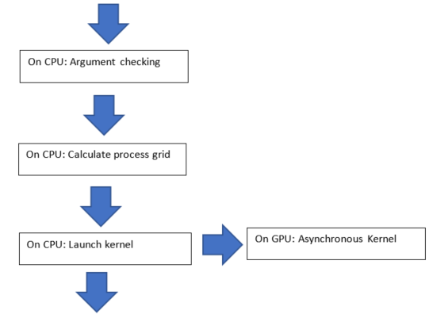

.. toctree::
   :maxdepth: 4
   :caption: Contents:

***********************
API
***********************

Rules for obtaining the rocBLAS API from Legacy BLAS
====================================================

1. The Legacy BLAS routine name is changed to lower case, and prefixed
   by rocblas\_.

2. A first argument rocblas_handle handle is added to all rocBlas
   functions.

3. Input arguments are declared with the const modifier.

4. Character arguments are replaced with enumerated types defined in
   rocblas_types.h. They are passed by value on the host.

5. Array arguments are passed by reference on the device.

6. Scalar arguments are passed by value on the host with the following
   two exceptions. See the section Pointer Mode for more information on
   these two exceptions.

-  Scalar values alpha and beta are passed by reference on either the
   host or the device.

-  Where Legacy BLAS functions have return values, the return value is
   instead added as the last function argument. It is returned by
   reference on either the host or the device. This applies to the
   following functions: xDOT, xDOTU, xNRM2, xASUM, IxAMAX, IxAMIN.

7. The return value of all functions is rocblas_status, defined in
   rocblas_types.h. It is used to check for errors.

LP64 interface
==============

The rocBLAS library is LP64, so rocblas_int arguments are 32 bit and
rocblas_long arguments are 64 bit.

Column-major storage and 1 based indexing
=========================================

rocBLAS uses column-major storage for 2D arrays, and 1 based indexing
for the functions xMAX and xMIN. This is the same as Legacy BLAS and
cuBLAS.

If you need row-major and 0 based indexing (used in C language arrays)
download the `CBLAS <http://www.netlib.org/blas/#_cblas>`__ file
cblas.tgz. Look at the CBLAS functions that provide a thin interface to
Legacy BLAS. They convert from row-major, 0 based, to column-major, 1
based. This is done by swapping the order of function arguments. It is
not necessary to transpose matrices.

Pointer mode
============

The auxiliary functions rocblas_set_pointer and rocblas_get_pointer are
used to set and get the value of the state variable
rocblas_pointer_mode. This variable is stored in rocblas_handle. If rocblas_pointer_mode ==
rocblas_pointer_mode_host then scalar parameters must be allocated on
the host. If rocblas_pointer_mode == rocblas_pointer_mode_device, then
scalar parameters must be allocated on the device.

There are two types of scalar parameter: 

* scaling parameters like alpha and beta used in functions like axpy, gemv, gemm 2

* scalar results from functions amax, amin, asum, dot, nrm2

For scalar parameters like alpha and beta when rocblas_pointer_mode ==
rocblas_pointer_mode_host they can be allocated on the host heap or
stack. The kernel launch is asynchronous, and if they are on the heap
they can be freed after the return from the kernel launch. When
rocblas_pointer_mode == rocblas_pointer_mode_device they must not be
changed till the kernel completes.

For scalar results, when rocblas_pointer_mode ==
rocblas_pointer_mode_host then the function blocks the CPU till the GPU
has copied the result back to the host. When rocblas_pointer_mode ==
rocblas_pointer_mode_device the function will return after the
asynchronous launch. Similarly to vector and matrix results, the scalar
result is only available when the kernel has completed execution.

Asynchronous API
================

rocBLAS functions will be asynchronous unless:

* the function needs to allocate device memory

* the function returns a scalar result from GPU to CPU

The order of operations in the asynchronous functions is as in the figure
below. The argument checking, calculation of process grid, and kernel 
launch take very little time. The asynchronous kernel running on the GPU 
does not block the CPU. After the kernel launch the CPU keeps processing 
the next instructions.

.. asynch_blocks

   Order of operations in asynchronous functions

The above order of operations will change if there is logging, or if the
function is synchronous. Logging requires system calls, and the program 
will need to wait for them to complete before executing the next instruction.
See the Logging section for more information.

.. note:: The default is no logging.

If the cpu needs to allocate device memory, it needs to wait till this is complete before
executing the next instruction. See the Device Memory Allocation section for more information.

.. note:: Memory can be pre-allocated. This will make the function asynchronous as it removes the need for the function to allocate memory.

The following functions copy a scalar result from GPU to CPU if
rocblas_pointer_mode == rocblas_pointer_mode_host: asum, dot, max, min, nrm2.

This makes the function synchronous, as the program will need to wait 
for the copy before executing the next instruction. See the section on 
Pointer Mode for more information

.. note:: Set rocblas_pointer_mode to rocblas_pointer_mode_device make the function asynchronous by keeping the result on the GPU.

The order of operations with logging, device memory allocation and return of a scalar
result is as in the figure below:

.. asynch_blocks
.. figure:: ../fig/synchronous_function.PNG
   :alt: code blocks in synchronous function call
   :align: center

   Code blocks in synchronous function call
